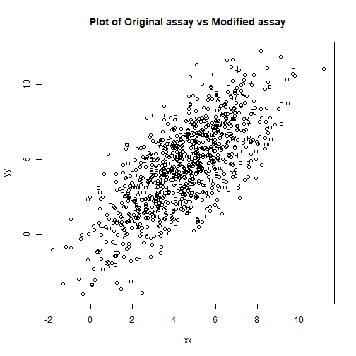
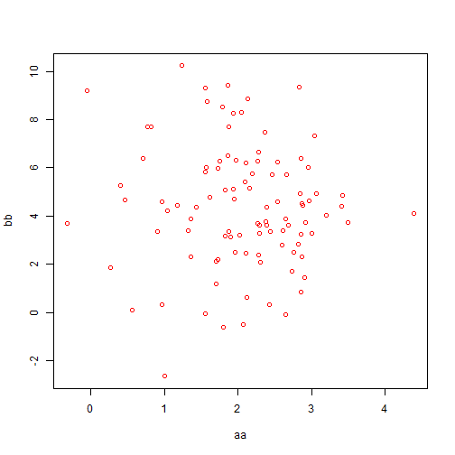

Introduction
========================================================
author:  Henok Woldu  
date:    May 07, 2018
autosize: true

Basic Plot in R
========================================================

Simple plot in R.




Slide With Code
========================================================
How to define an object in r and assign values.

We don't want to make this too complicated but keep it simple

Here are a few things we need read apriori to understand this.


```r
a <- 25
b <- 35
c <- a + b

d <- a +c
```

Slide With Plot
========================================================




New GitKraken Intro
==================================================


```r
# This is how to use Git kraken in github
# I can not tell how much I am in love with it
# Please consider using it 
# All is to make our collaboration faster
```

